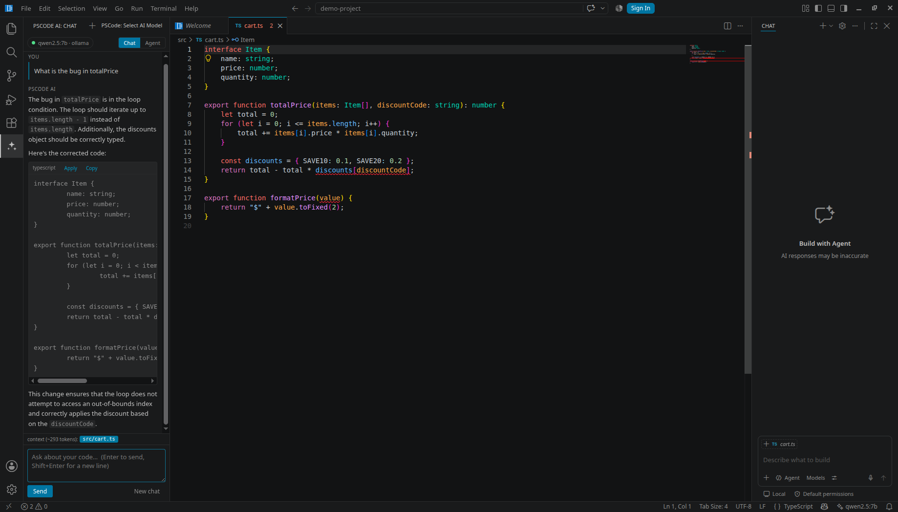
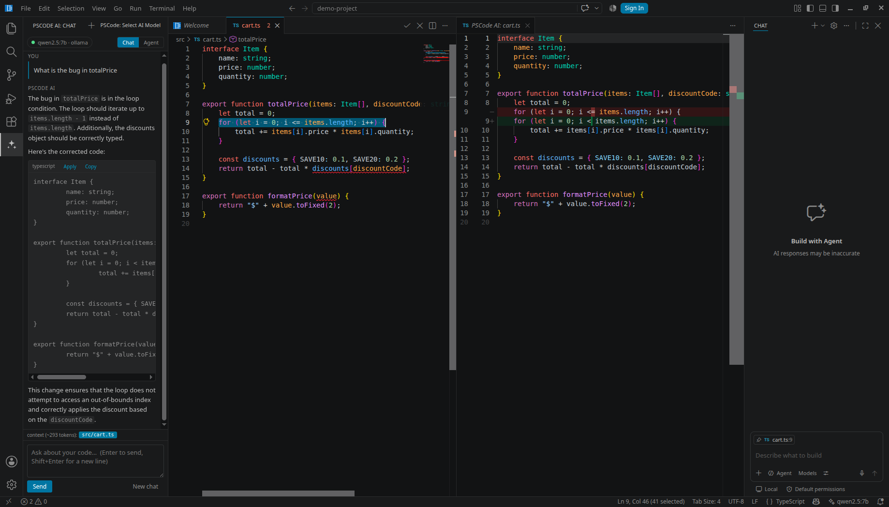

<div align="center">


# PSCode

**A VS Code–based IDE with a local-first AI agent built in.**

Chat, inline edit and an agentic tool loop that run entirely against a model on your own
machine — no API key, no account, no code leaving the laptop.

[Why](#why-i-built-this) · [Features](#features) · [Install](#install) ·
[Architecture](#architecture) · [What I wrote](#what-i-wrote-vs-what-came-from-vs-code) ·
[Docs](docs/ARCHITECTURE.md)

</div>

---

## What it looks like

**Chat with real workspace context** — the model found the off-by-one bug in `totalPrice`.
Note the chip at the bottom of the panel: `context (~293 tokens): src/cart.ts`, so you always
see exactly what was sent.



**Inline edit (Ctrl+I)** — the proposal streams into a diff beside your file. The red line is
`i <= items.length`, the green one `i < items.length`. Your buffer is untouched until you press
Accept in the editor title bar.



All of it running against `qwen2.5:7b` on localhost, on a CPU, with no network access.

---

## Why I built this

Cursor and Antigravity showed that the fastest way to ship an AI-native IDE is to fork VS Code
and add the AI as a first-class citizen rather than a bolted-on plugin. Both are closed source,
and both send your code to someone else's servers.

PSCode is that same architecture, done in the open, pointed at a model running on `localhost`.
I built it to answer a specific question end to end: **what does it actually take to put an AI
agent inside an editor?** Not the prompt — the plumbing. Streaming a token to a UI without
janking it. Reassembling tool-call fragments that arrive four bytes at a time. Refusing to let
a model write to `../../.ssh/id_rsa`. Showing a diff the user can reject.

> **On the fork:** PSCode is a fork of [microsoft/vscode](https://github.com/microsoft/vscode)
> (MIT). The editor, terminal and extension host are Microsoft's work, not mine. Everything AI
> in this repo — `extensions/pscode-ai/`, 3,695 lines across 17 TypeScript modules — is mine, and
> it is deliberately confined to one directory so the boundary is obvious. See
> [What I wrote](#what-i-wrote-vs-what-came-from-vs-code).

---

## Features

### Chat with real workspace context
A panel in the **right-hand side bar** — where a cloud assistant would normally sit — that streams
from your local model and knows what you are looking at. It sends
your selection, the active file, language-server errors for that file, and the names of your other
open tabs. Type `@filename` to pull any other file in. Every context block sent is shown as a chip
under the composer with an approximate token count, so nothing is attached behind your back.

Every fenced code block in a reply gets **Apply** and **Copy** buttons. **Apply never edits
blind:** it builds the proposed file, opens it in a real side-by-side diff, and puts an
Accept / Reject card in the panel — the same gate agent mode uses. With a selection active the
block replaces the selection; with nothing selected the block is treated as the file's new
contents, which is what a model that reprints a whole file actually means. A wrong guess costs
you one click, because you see it in the diff first.

### Inline edit — <kbd>Ctrl</kbd>+<kbd>I</kbd>
Select code, describe the change, and watch the model rewrite it **into a live diff view** beside
your file. Nothing touches your buffer until you press Accept. If the file changed while the model
was thinking, PSCode notices the version mismatch and refuses to apply a stale edit rather than
silently corrupting your work.

With nothing selected, <kbd>Ctrl</kbd>+<kbd>I</kbd> operates on the current line.

### Agent mode
Switch the panel to **Agent** and the model gets ten tools:

| Tool | What it does | Guard |
|---|---|---|
| `project_map` | Source files grouped by directory — the layout at a glance | skips `node_modules`, build output, vendor |
| `find_symbol` | Where a class/function/variable is **defined**, anywhere in the project | language-server resolved |
| `find_usages` | **Every** place a symbol is used, across every file | language-server resolved |
| `read_file` | Read a file, optionally a line range | path confined to workspace |
| `list_dir` | List a directory | path confined to workspace |
| `search_text` | Find text (optionally regex) across the workspace | skips `node_modules`, `.git`, build output |
| `get_diagnostics` | Read compiler/linter errors | — |
| `replace_in_file` | Replace an exact snippet | must match exactly once; diff + Accept/Reject |
| `write_file` | Create or overwrite a file | diff + Accept/Reject in the panel |
| `run_command` | Run a shell command, return output | Accept/Reject showing the exact command |

**It works on the whole project, not one file.** `find_usages` goes through the language server, so
asking "what breaks if I change this?" gets an answer that is *resolved*, not guessed:

```
find_usages("discountFor")
  → "discountFor" is defined at src/discounts.ts:7
  → 5 references in 3 files:
      src/checkout.ts — line 9
      src/discounts.ts — line 7
      src/report.ts — line 4
```

The agent prompt tells it to do this discovery for every affected file *before* editing any of them,
so it does not edit a file and then find a caller it had not read.

Nothing is written without your click. When the agent wants to change a file, PSCode opens a
**side-by-side diff** beside your code and puts an **Accept / Reject** card in the chat panel:

```
┌─────────────────────────────────────┐
│ ✎ Edit src/cart.ts                  │
│ line 9                              │
│ [ Accept ]  [ Reject ]     View diff│
└─────────────────────────────────────┘
```

This deliberately replaced a modal dialog. A modal steals focus and — because it confirms on
Enter — can be dismissed by a stray keypress. The card resolves only when the webview posts back
the matching request id, which no keystroke can forge. Rejecting tells the model it was rejected,
so it asks what to change instead of retrying the same edit.

The loop is bounded by `pscode.agent.maxIterations` (default 12). When it hits that ceiling it
**says so in the transcript** instead of stopping quietly — a silent stop is indistinguishable
from a finished task, which is how agents end up appearing to lie about their work.

### Bring your own model
| Provider | Use it for | Key needed |
|---|---|---|
| **`ollama`** (default) | Fully local, fully offline | no |
| `openai-compatible` | llama.cpp, LM Studio, vLLM, OpenRouter, OpenAI | depends |
| `anthropic` | Claude, when a 7B model isn't enough | yes |

All three implement one 6-method interface (`LLMProvider`). Chat, inline edit and the agent are
written against that interface only and contain no provider-specific code.

### Extensions still work
PSCode points at [Open VSX](https://open-vsx.org) rather than Microsoft's marketplace, whose terms
restrict it to official VS Code builds. Themes, language packs and most tooling install normally.

---

## Install

PSCode installs like any other editor. Pick one of the three routes below, then point it at a
model.

### 1. Get a model running first

```bash
# Ollama — the default, and the simplest
curl -fsSL https://ollama.com/install.sh | sh
ollama serve &
ollama pull qwen2.5:7b        # tool-capable, ~4.7 GB, runs on CPU
```

Any tool-capable model works. `qwen2.5:7b` and `llama3.2` are both good starting points; Agent
mode needs tool calling, so a model without it will only work in Chat mode. PSCode talks to
`http://127.0.0.1:11434` by default and the status bar turns red if nothing answers there.

### 2a. Debian / Ubuntu — the `.deb`

```bash
sudo apt install ./pscode_<version>_amd64.deb
```

`apt` pulls in the dependencies; `dpkg -i` alone will not. That gives you the same things the
VS Code package gives you:

| | |
|---|---|
| `pscode` on your `PATH` | `pscode .` opens the current folder, like `code .` |
| A desktop entry | "PSCode" in the application menu, with its own icon |
| `pscode://` URL handler | registered for deep links |
| An `editor` alternative | registered at priority 0, so it never silently becomes your default |

Uninstall with `sudo apt remove pscode`.

> **This package adds no third-party apt repository and installs no signing key.** Upstream's
> `postinst` registers Microsoft's apt repo so VS Code can update itself; PSCode is not published
> to any repo, so that whole block is removed. Updating means installing a newer `.deb`.

### 2b. Any Linux — the tarball, no root needed

```bash
tar -xzf PSCode-linux-x64-<version>.tar.gz -C ~/.local/opt
ln -sf ~/.local/opt/PSCode-linux-x64/bin/pscode ~/.local/bin/pscode
```

Make sure `~/.local/bin` is on your `PATH`. Nothing is written outside your home directory, and
you can delete the folder to uninstall. To get a menu entry as well:

```bash
sed -e "s|/usr/share/pscode/pscode|$HOME/.local/opt/PSCode-linux-x64/pscode|" \
    -e "s|Icon=pscode|Icon=$HOME/.local/opt/PSCode-linux-x64/resources/app/resources/linux/code.png|" \
    resources/linux/code.desktop > ~/.local/share/applications/pscode.desktop
update-desktop-database ~/.local/share/applications
```

### 2c. Build it yourself

```bash
# Build prerequisites
sudo apt-get install -y build-essential pkg-config python3 \
    libx11-dev libxkbfile-dev libkrb5-dev

nvm install && nvm use        # honours .nvmrc (Node 24.18.0)
npm install                   # ~10 min
npm run compile               # ~15-30 min the first time
./scripts/code.sh             # launch the dev build
```

> Only `native-keymap` (x11 + xkbfile) and `kerberos` (libkrb5) need dev headers — there is no
> `keytar`, so `libsecret` is not required. If you cannot use `sudo`, `apt-get download` works
> unprivileged: fetch those `-dev` packages, `dpkg -x` them into a prefix, repoint the `.pc` files
> at it, and export `PKG_CONFIG_PATH` / `CPATH` / `LIBRARY_PATH`. That is how this build was made.

**Run the dev build with `./scripts/code.sh`, not `.build/electron/pscode` directly.** The launcher
sets the environment that puts the app in development mode; the bare binary starts in "built" mode,
looks for bundled assets a dev build never produces, and renders a blank window.

To produce the installers yourself:

```bash
npm run gulp vscode-linux-x64-min            # production bundle → ../VSCode-linux-x64
npm run gulp vscode-linux-x64-prepare-deb    # stage the package tree
npm run gulp vscode-linux-x64-build-deb      # → .build/linux/deb/amd64/deb/*.deb

# the tarball is just the built tree
tar -czf PSCode-linux-x64-$(node -p "require('./package.json').version").tar.gz \
    -C .. VSCode-linux-x64
```

`prepare-deb` downloads a Chromium sysroot and runs `dpkg-shlibdeps` to compute the `Depends:`
field, so it needs network and a working `curl`. It also compares the result against the list
checked into `build/linux/debian/dep-lists.ts` and **fails the build if they differ** — that guard
is deliberate, so if you change what gets bundled, update that list rather than disabling it.

### 3. Use it

| Shortcut | Action |
|---|---|
| <kbd>Ctrl</kbd>+<kbd>L</kbd> | Open the AI chat panel |
| <kbd>Ctrl</kbd>+<kbd>I</kbd> | Edit the selection (or current line) inline |
| <kbd>Ctrl</kbd>+<kbd>Shift</kbd>+<kbd>L</kbd> | Add the selection to the chat composer |

The status bar shows the live model and turns red when the server is unreachable — click it to
switch models from whatever the server reports it has.

**If the AI panel is missing, the folder is untrusted.** `pscode-ai` declares
`untrustedWorkspaces.supported = false`, so in an untrusted workspace it does not load at all.
Trust the folder, or launch with `--disable-workspace-trust`.

---

## Configuration

All settings live under `pscode.` in Settings (<kbd>Ctrl</kbd>+<kbd>,</kbd>).

| Setting | Default | Notes |
|---|---|---|
| `pscode.ai.provider` | `ollama` | `ollama` \| `openai-compatible` \| `anthropic` |
| `pscode.ai.endpoint` | `http://127.0.0.1:11434` | Base URL, no trailing path |
| `pscode.ai.model` | `qwen2.5:7b` | Must already be pulled |
| `pscode.ai.apiKey` | `""` | `PSCODE_API_KEY` env var wins over this |
| `pscode.ai.temperature` | `0.2` | Low, because these are code edits |
| `pscode.ai.maxTokens` | `4096` | Per response |
| `pscode.ai.requestTimeoutMs` | `300000` | Generous: CPU inference is slow to first token |
| `pscode.ai.contextBudgetChars` | `24000` | Lower it for small-context models |
| `pscode.agent.enabled` | `true` | Turns Agent mode off entirely |
| `pscode.agent.maxIterations` | `12` | Tool rounds before the loop stops |
| `pscode.agent.approveShellCommands` | `true` | **Leave this on** unless you know why you're turning it off |
| `pscode.agent.approveFileWrites` | `true` | **Leave this on** likewise |

---

## Architecture

```
┌──────────────────────────────────────────────────────────────┐
│  Webview  (sandboxed: no Node, no fs, no network)            │
│  media/chat.js · chat.css   — renders markdown, posts intents │
└───────────────────────────┬──────────────────────────────────┘
                            │  postMessage  (the privilege boundary)
┌───────────────────────────▼──────────────────────────────────┐
│  Extension host                                              │
│                                                              │
│  chat/chatViewProvider.ts   owns conversation, brokers all    │
│                             privileged work                   │
│  inline/inlineEdit.ts       Ctrl+I → streamed diff → accept   │
│  inline/proposalDocuments   virtual read-only diff documents  │
│  agent/agentLoop.ts         stream → run tools → repeat       │
│  agent/tools.ts             7 tools + the security boundary   │
│  context/contextBuilder.ts  what the model is allowed to see  │
│                                                              │
│  providers/  ── LLMProvider ────────────────────────────────┐ │
│    ollama.ts          NDJSON, native /api/chat             │ │
│    openaiCompat.ts    SSE, reassembles tool-call fragments  │ │
│    anthropic.ts       SSE, tool_use blocks                  │ │
│    http.ts            Node http/https, zero npm deps        │ │
└──────────────────────────┬───────────────────────────────────┘
                           │  HTTP
                    ┌──────▼──────┐
                    │  localhost  │   Ollama · llama.cpp · LM Studio
                    └─────────────┘
```

Three decisions shape everything else:

1. **The webview has no privileges.** It renders and posts intents. It cannot read a file, run a
   command or open a socket. A strict CSP with a per-render nonce blocks inline script and every
   remote origin. Prompt-injected markdown in a model reply therefore cannot do anything but
   render as text.

2. **The provider interface is the only seam the features know about.** `providers/*.ts` import
   nothing from `vscode`, which is why they can be — and are — tested in plain Node against a
   real model server.

3. **AI output is a proposal, never a write.** Inline edits and agent edits are published to a
   virtual `pscode-proposal:` document and shown in VS Code's own diff editor. The user approves
   the exact text that gets applied.

Full detail: **[docs/ARCHITECTURE.md](docs/ARCHITECTURE.md)**.

---

## Testing

The provider layer is exercised against a **live local model**, not a mock — the bugs that matter
here (a stream that never terminates, tool arguments in the wrong shape, an unhelpful error on a
dead port) are precisely the ones a mocked socket cannot reproduce.

```bash
ollama serve &
ollama pull llama3.2
node extensions/pscode-ai/test/provider-smoke.js
```

```
PASS  listModels returns models — llama3.2:latest, qwen2.5:7b
PASS  stream emits text events
PASS  stream emits exactly one done
PASS  stream reports usage
PASS  model produced text — "Ready"
PASS  tool call is parsed — read_file({"path":"src/main.ts"})
PASS  tool args normalise to JSON text — path=src/main.ts
PASS  tool call has an id
PASS  dead endpoint throws ProviderError
PASS  error carries an actionable hint
PASS  missing model throws ProviderError

ALL CHECKS PASSED
```

---

## What I wrote vs what came from VS Code

Being precise about this matters more than the line count.

**Mine — `extensions/pscode-ai/`, 3,695 lines, 17 TypeScript modules:**

| Area | Files |
|---|---|
| Provider layer | `providers/{types,http,ollama,openaiCompat,anthropic,registry}.ts` |
| Agent | `agent/{agentLoop,tools,prompts}.ts` |
| Chat | `chat/chatViewProvider.ts`, `media/chat.{js,css}` |
| Inline edit | `inline/{inlineEdit,proposalDocuments}.ts` |
| Context | `context/contextBuilder.ts` |
| Shell | `extension.ts`, `statusBar.ts`, `util/{logger,cancellation}.ts` |
| Test | `test/provider-smoke.js` |

**Upstream files I modified — 26, plus 2 deleted,** on top of removing the bundled Copilot
extension. That count is not a claim you have to take on trust:

```bash
git diff --name-status $(git rev-list --max-parents=0 HEAD) -- . \
  ':(exclude)extensions/pscode-ai/**' ':(exclude)extensions/copilot/**' \
  ':(exclude)README.md' ':(exclude)docs/**' ':(exclude)*AGENTS.md' ':(exclude)*CLAUDE.md'
```

The interesting ones:

| File | Change |
|---|---|
| `product.json` | Identity, fresh install GUIDs, Open VSX gallery, `disableCloudChat` |
| `package.json` | Name, version, author, repository; drop the copilot build steps |
| `build/gulpfile.extensions.ts` | Register `pscode-ai` for compilation |
| `build/npm/dirs.ts` | Register `pscode-ai`, drop `extensions/copilot` |
| `resources/linux/code.png`, `resources/win32/code.ico` | New app icon |
| `resources/linux/*.desktop` | Tagline and keywords |
| `src/vs/base/common/product.ts` | Declare the `disableCloudChat` flag |
| `src/vs/workbench/services/chat/common/chatEntitlementService.ts` | Honour it — and refuse to let anything un-hide it (see below) |
| `resources/linux/debian/*` | Rebrand the package, and **delete the Microsoft apt-repo registration** |
| `resources/linux/code.appdata.xml` | PSCode's own AppStream metadata |
| `build/gulpfile.vscode.ts` | Skip the Copilot ripgrep shim, which has nothing to shim here |
| `build/linux/dependencies-generator.ts` | Skip the tunnel binary this fork does not build |
| `build/linux/debian/dep-lists.ts` | Regenerated reference dependency list |
| `build/gulpfile.vscode.linux.ts` | Normalise package permissions; drop the debconf template |
| `build/hygiene.ts`, `build/gulpfile.hygiene.ts` | Drop a check that read the deleted manifest |
| `build/next/build-fast.ts` | Skip the copilot lane when it is absent |
| `.../welcomeGettingStarted/common/gettingStartedContent.ts` | "VS Code" → "PSCode" on the Welcome page |
| `.../welcomeWalkthrough/browser/editor/vs_code_editor_walkthrough.ts` | Same, in the editor playground |
| `src/vs/workbench/browser/actions/helpActions.ts` | Same, in the Help menu |

`extensions/copilot` — the bundled GitHub Copilot Chat extension, **4,122 files and 46.9 MB** —
was deleted outright. It was roughly 87% of the repository.

**Deleting the extension is not what removes the UI.** Every Copilot surface — the chat view in
the auxiliary bar, the first-run "Welcome to VS Code / Sign in to use GitHub Copilot" overlay, the
Agents-window button in the title bar, the Copilot status entry — is gated on one context key,
`chatSetupHidden`. `disableCloudChat` sets it at startup, but that alone is not enough: an account
policy contribution calls `setForceHidden(false)` for every unblocked account, and because this
product returns early before building a `ChatEntitlementContext`, that call lands in a fallback
that writes the key directly and turns it back off. So the product decision has to outrank the
policy: `setForceHidden` returns early, and the entitlement context pins the key rather than
restoring it from stored state.

This only ever showed up **on a clean profile** — an existing profile has the view hidden in its
stored workbench state, which masks it completely. Worth remembering when testing any
first-run behaviour: `--user-data-dir` to a fresh directory, or you are testing your own history.

**Everything else is Microsoft's.** The editor is Monaco, the terminal is xterm.js + node-pty,
the extension host and IPC are VS Code's. I did not write those and do not claim to.

---

## Known limitations

Stated plainly, because pretending otherwise wastes your time:

- **CPU inference is slow.** On a 12-core CPU with no GPU, a 7B Q4 model produces roughly
  8–20 tokens/sec. Chat and inline edit feel fine. Long agent runs require patience.
- **No tab autocomplete.** Ghost-text completion needs sub-200 ms round trips, which CPU-only
  inference cannot deliver. Shipping a laggy version would be worse than not shipping it.
- **Agent mode is only as good as the model.** 7B models lose track of multi-step plans, emit
  malformed tool JSON, and will keep "improving" a file after the task is done — one run made three
  successive edits and corrupted a function signature. PSCode now blocks exact repeat calls and caps
  edits at two per file per task, which stops the damage, but it cannot make a small model reason
  better. They also sometimes *narrate* changes they did not make, so read the diff, not the prose.
- **No conversation persistence.** Chats live in memory and die with the window.
- **Linux is the only tested target.** The build config is cross-platform; I have only run it here.
- **Only the Linux `.deb` path is exercised.** No signed macOS/Windows installers.
- **"VS Code" still appears in places.** I renamed it on the Welcome page, the editor playground
  and the Help menu. There are ~1,488 more occurrences across ~1,052 files, nearly all code
  comments and extension-author schema docs that no user ever sees. Renaming them all would touch
  most of the repository and make every upstream merge painful, so I stopped at the visible ones.

---

## Roadmap

- [ ] Persist conversations across restarts
- [ ] Tab autocomplete with a small FIM model, behind a GPU check
- [ ] Multi-file diff review before applying a whole agent changeset
- [ ] `@symbol` context via the language server, not just `@file`
- [ ] Prompt-token caching to cut the re-send cost of long chats

---

## Licence and attribution

PSCode is MIT, as is the upstream VS Code source it is built from. See [LICENSE.txt](LICENSE.txt).

This is **not** a Microsoft product and is not affiliated with or endorsed by Microsoft.
"Visual Studio Code" and its logo are Microsoft trademarks; PSCode uses neither — it ships its
own name and icon, which is exactly why the rebrand in `product.json` is thorough rather than
cosmetic. For the same reason PSCode uses Open VSX instead of the Visual Studio Marketplace,
whose terms of use permit access only from official VS Code builds.

Built by **Pankaj Sharma** — [github.com/pankajsharma21](https://github.com/pankajsharma21)
